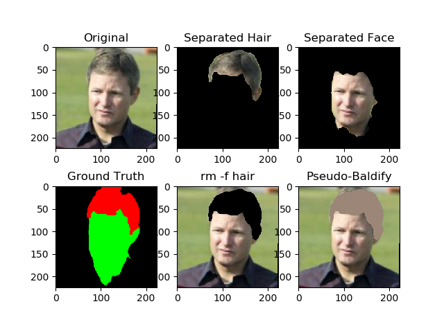

HairNet Hair Segmentator
========================



This is a neural network made for separating hair from face, with the end goal to make everyone bald.

That end goal was merely a single part of a master plan to make live hair-simulation software that allows people to try on different hairstyles with the press of a button. That unfortunately didn't happen because it turns out [face pose detection is kinda hard](https://github.com/Plenglin/Head-Pose-Net) and 3D modeling hair is also kinda hard and mobile phones might not have the computing capacity to do this entire pipeline.

The dataset used to train it was [LFW](http://vis-www.cs.umass.edu/lfw/). It should be placed in a directory called `data`. Additionally, there should be images without any faces in them in a subdirectory `data/faceless`.

The structure should look like this:
```
/
  data/
    faceless/
    lfw/
      lfw_funneled/
        [...]
      parts_lfw_funneled_gt_images/
        [...]
  [...]
```

There is a section of commented code in `organize.py` that generates `.bmp`'s (TensorFlow likey) from the `.ppm` files (TensorFlow not-so-likey). The rest of `organize.py` creates `train.csv` and `test.csv` files that map the original `.jpg` to the ground truth `.bmp`. 

The model schema is stored in `model.py`, and running `train.py` _should_ start the training process. `cam.py` runs the model on camera data. `test.py` creates the image shown above.
